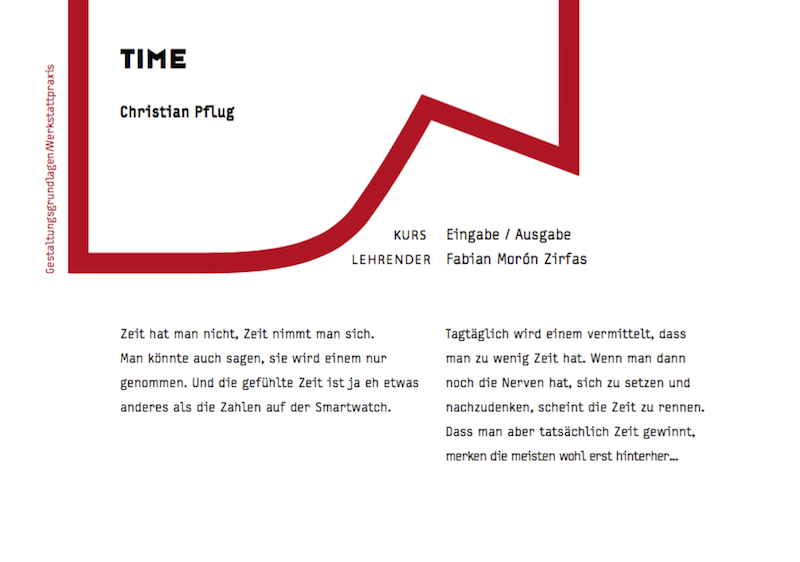

## Repo for motor poster project within course “Eingabe/Ausgabe — Fundamentals of process oriented design” FHP - University of Applied Sciences Potsdam. Exhibit text kept in original language for accuracy.

As kick off into the third project, we started with an abstract “hacking from objects”. In this case we were to design a motor poster from an RC-car. Parts from the RC-Car such as DC-Motor, Servos, LEDs, Batteries, Potentiometers, Pushbuttons and RC/TX-Modules gave us an idea of how we could use everyday items to build something new. The first Idea was an Wall advertising that has small subtext written somewhere on the bottom or the sides, so small that it is unreadable just standing in front of it.
This lead to the second idea - a wall advert (preferably for optometrists or oculists), that blurs when you walk close to it. This was built into a first prototype with a glass frame and translucent paper directly behind it and the advertising poster behind that. if anyone walked close to it, a motor pulled the poster away from the translucent paper, which effected in a blur.

After experimenting a lot with the technics of the poster-pulling-mechanism, I decided that the optometry-context isn’t really that exciting or what I’d like my project to communicate.
A friend told me the phrase “kill your darlings” — meaning that if you’re so deep fixed onto one idea, it’s often best to start all over. So I decided to take the time to think about it. But I realized, that I don’t have time to think about it. The time was already there to present our state, So I made time my prototype.

I hacked a clock to run how I want it to by just applying the shaft of a stepper motor to the adjustment wheel on the back of the clock.

I experimented a lot with capacitive sensors which were also able to give an analogue input, but the easiest way was to just use a pushbutton and use the time sat as variable.
I prepared a scenery with wallpaper, a cozy armchair, a lamp and a beautiful picture (thanks to [JasperP](github.com/JasperP)). The clock would then be connected to the pushbutton inside the cushions, criticizing everyone who would dare to sit down and relax, just like every student does at the end of the semester. Once a person sits down in the chair, the clock unobtrusively starts to go faster until it rotates so fast that the rattling noise of shaking plastic hands can’t be overheard. As soon as the person stands up, the time either stops or goes back to the time, (s)he sat down.

## License:

# The MIT License (MIT)

# Copyright (c) 2015 Christian Pflug

Permission is hereby granted, free of charge, to any person obtaining a copy
of this software and associated documentation files (the "Software"), to deal
in the Software without restriction, including without limitation the rights
to use, copy, modify, merge, publish, distribute, sublicense, and/or sell
copies of the Software, and to permit persons to whom the Software is
furnished to do so, subject to the following conditions:

The above copyright notice and this permission notice shall be included in all
copies or substantial portions of the Software.

THE SOFTWARE IS PROVIDED "AS IS", WITHOUT WARRANTY OF ANY KIND, EXPRESS OR
IMPLIED, INCLUDING BUT NOT LIMITED TO THE WARRANTIES OF MERCHANTABILITY,
FITNESS FOR A PARTICULAR PURPOSE AND NONINFRINGEMENT. IN NO EVENT SHALL THE
AUTHORS OR COPYRIGHT HOLDERS BE LIABLE FOR ANY CLAIM, DAMAGES OR OTHER
LIABILITY, WHETHER IN AN ACTION OF CONTRACT, TORT OR OTHERWISE, ARISING FROM,
OUT OF OR IN CONNECTION WITH THE SOFTWARE OR THE USE OR OTHER DEALINGS IN THE
SOFTWARE.
